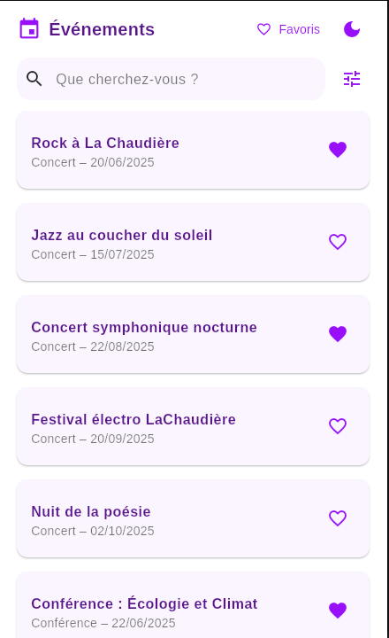
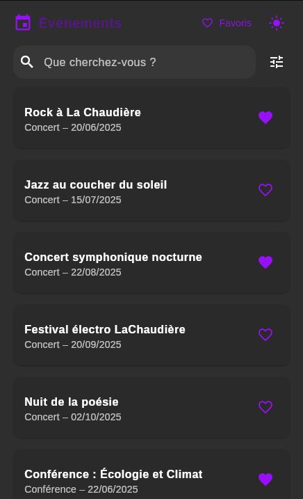
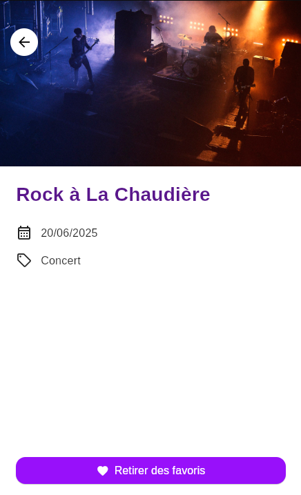
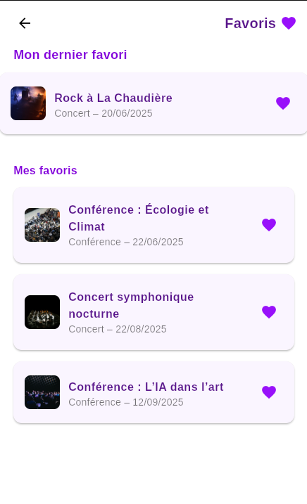

# 🎭 LaChaudiere.app

**LaChaudiere.app** est une application Flutter développée dans le cadre de la SAE S4 DWM.01.  
Elle permet d’explorer, trier, rechercher et sauvegarder des événements culturels, avec ou sans connexion internet.

---

## 📱 Aperçu de l'application

| Accueil (thème clair) | Accueil (thème sombre) |
|-----------------------|------------------------|
|  |  |

| Détail d’un événement | Favoris |
|------------------------|---------|
|  |  |

---

## 📦 Installation Flutter

```bash
flutter pub get
```

## 🚀 Lancement

```bash
flutter run -d linux
```

---

## 📁 Structure du projet

```
chaudiere_app/
├── assets/
│   ├── images/                 → Bannières & icônes diverses
│   ├── icon/                   → Icone de l'application
│   └── screens/                → Captures d’écran pour README
├── core/models/                → Modèle `Event`
├── database/                  → Helper SQLite
├── providers/                 → Provider d’état (EventProvider)
├── repositories/              → Appels API et logique de sync
├── screens/                   → Interface utilisateur
├── theme/                     → Thèmes clair/sombre
└── main.dart
```

---

## 🧪 Testé sur

| Plateforme | Statut |
|------------|--------|
| 🐧 Linux (Ubuntu) | ✅ |
| 🪟 Windows | ⚠️ Non testé |
| 🍏 macOS | ⚠️ Non testé |

---

## 🔧 Icône personnalisée

L’icône de l’app a été générée avec le package [`flutter_launcher_icons`](https://pub.dev/packages/flutter_launcher_icons).

Pour la regénérer (si nécessaire) :

```bash
flutter pub run flutter_launcher_icons
```

---

## 👨‍👩‍👧‍👦 Auteurs et contributions

> 💡 Contributions basées sur l’historique GitHub (`commits`, `PRs`)

### 🔨 Développement principal
- **Robin Carette**  
  - Init Flutter, navigation Master/Detail, design final, DB/API sync, thème, icône

### 🧪 Fonctionnalités & UI/UX
- **Paul5400**  
  - Favoris, thème sombre, filtres par catégorie, design page favoris

- **ValentinoLambert**  
  - Barre de recherche, tri des événements, retouches UI

- **e7160u**  
  - Filtrage par catégorie, tri & recherche initiale

---

## 📷 Captures d’écran

> Stocke les captures dans : `assets/screens/`

| Nom | Utilisation dans README |
|-----|--------------------------|
| `home_light.png` | Vue accueil thème clair |
| `home_dark.png` | Vue accueil thème sombre |
| `detail_event.png` | Détail d’un événement |
| `favorites.png` | Écran des favoris |

---

## 📘 Références

- [Sujet officiel SAE S4 DWM.01](./Sujet-flutter-SAE-S4-DWM.01_V2.pdf)
- [Flutter documentation](https://flutter.dev)
- [Sqflite (desktop)](https://pub.dev/packages/sqflite_common_ffi)

---

## 📝 License

Projet académique — Non destiné à une distribution publique ou commerciale.

---

**🎉 Merci pour votre lecture !**
